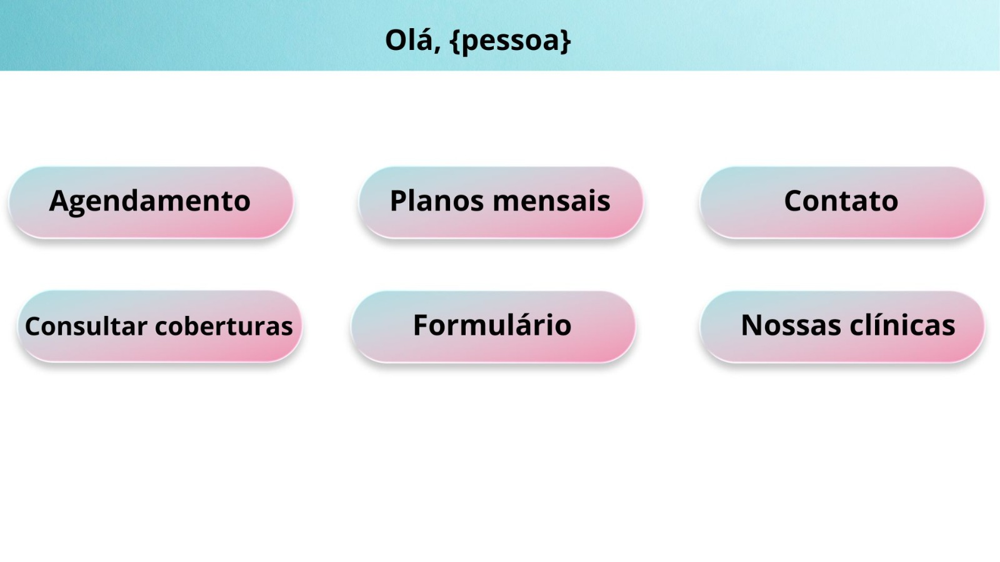
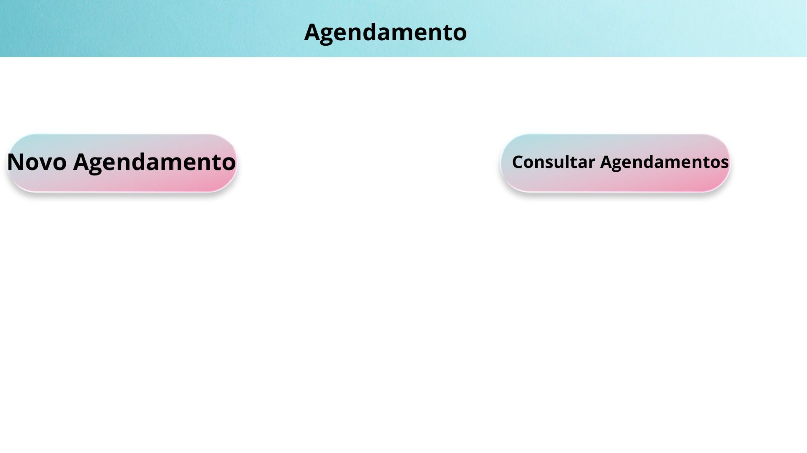
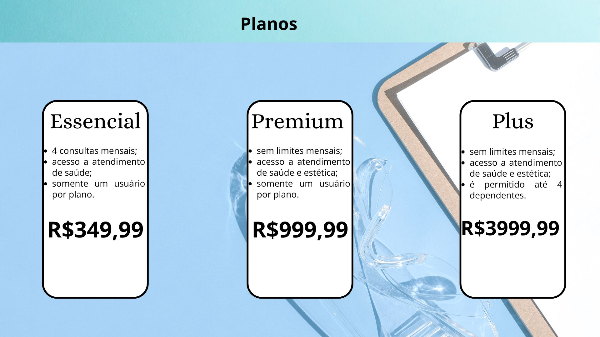
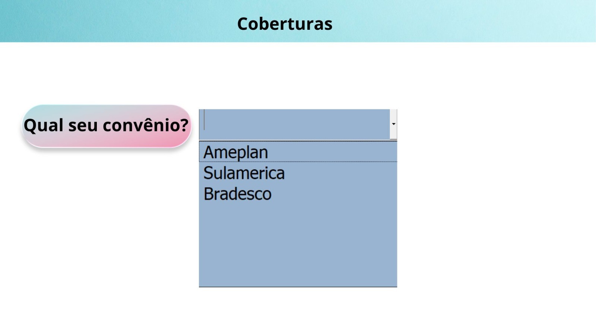

# clinica
# Design do Projeto - Sistema de Gestão de Clínica

Este repositório contém o design visual e os mockups para o futuro sistema de gestão de clínicas.

## Telas Principais

### 1. Tela de Login

Aqui o paciente ou administrador fará o login no sistema.

---

### 2. Tela de Agendamento do Paciente

Nesta tela, o paciente poderá visualizar os horários disponíveis e marcar sua consulta.

---

### 3. Planos mensais

Visão do administrador para gerenciar a entrada e saída de materiais.

---

### 4. Coberturas

Visão do administrador para gerenciar a entrada e saída de materiais.

